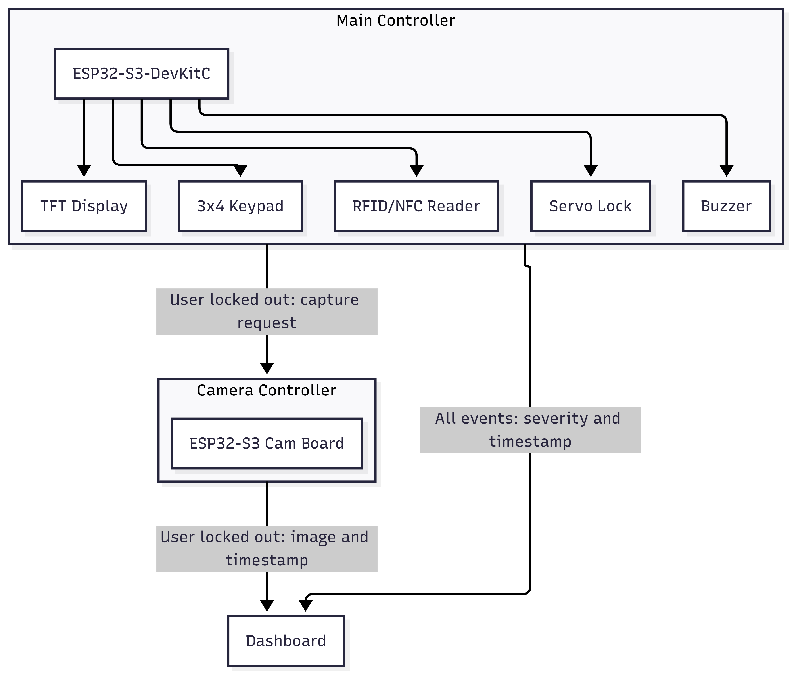

# Hardened Access Control System

**Status:** In Progress

## Overview
A hardware access control system using PIN and RFID/NFC as a linked two factor authentication (card scan unlocks a card specific PIN prompt). Built as a security assessment exercise rather than a standard access control build. The system will be intentionally built with no security hardening first, then attacked to identify real vulnerabilities, with each finding documented and fixed individually. All events will be logged and able to be viewed on a dashboard.

## Current State
- Working: PIN entry through keypad, LCD feedback, servo lock, buzzer feedback
- To be implemented: RFID/NFC reader, camera module, rate limiting, network layer, flash encryption
- Known insecure by design: Plaintext PIN comparison, no rate limitng, no encryption

## System Architecture

## Design Decisions
Any changes made to the architecture of this project is documented in the ADRs in docs/adr

## Prototypes
Each prototype is built with what parts I am able to use at the time of making them. Stored in prototypes/

### pin-entry-v1
- Built with a 3x4 keypad, LCD1602 (Did not have the TFT display at the time), servo, and buzzer. 
- PIN auto submits on the 4th digit. 
- No MFA with RFID, purely just PIN entry and validation.
- '#' isn't used here and '*' is used to erase the last entered digit.

### pin-entry-v2
- The TFT display now replaces the LCD1602. 
- Still no MFA with RFID implemented.
- Instead of auto submitting on digit 4, it now requires you to manually submit with '#' on the keypad. 